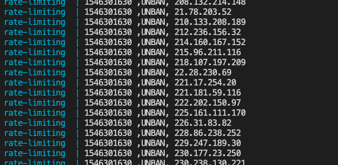
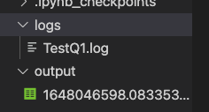

Rate-limiting
===
This package is use to process log data and create output file for instructions.

There are two usages are provided as below.

## Docker
Docker image is built: [timchencloud/rate-limiting-parser:latest](https://hub.docker.com/layers/timchencloud/rate-limiting-parser/latest/images/sha256:cb0d12c70afc099a4dd8a22e7ad6fffc36e77ce735e40312512441ed0c5b93d6)

### Prerequisite
Please use `docker-compose.yml` and `.env` to automate the whole process.

Please type your LOGFILEPATH, LOGFILENAME, OUTPUTPATH in`.env` to connect with container via volume.
```
#.env
LOGFILEPATH="./logs"
LOGFILENAME="TestQ1.log"
OUTPUTPATH="./output"
```

### Process
1. `docker-compose up`

2. `LOGFILENAME` in `LOGFILEPATH` will ce processed automatically
3. Check the output CSV file whick is named with timestamp in saved  `OUTPUTPATH` 



## Local
* `parser.py` is the main script
```
usage: parser.py [-h] -o OUTPUT -l LOG

This program outputs instructions for the load balancer to ban offending IP addresses.

optional arguments:
  -h, --help            show this help message and exit
  -o OUTPUT, --output OUTPUT
                        Folder for output CSV file
  -l LOG, --log LOG     Raw lof file for processing
```

* `parser.ipynb` is used to see the demo has been run

### Prerequisite
* Python Version: 3.9
* Packages:  pandas, csv, datetime, argparse