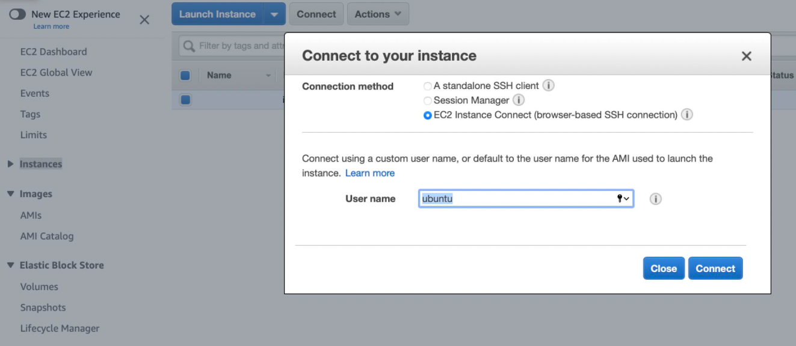

AWS API programming
===

## Prerequisite
- Install [AWS CLI](https://docs.aws.amazon.com/cli/latest/userguide/getting-started-install.html) on your machine.
- Since `username` of AWS instances could not be fetched automatically, you should navigate to `EC2 > Instances > EC2 Instance Connect` on AWS console, find **User name** value and manually fill in the username varaible in script.
  
- Path of your ssh private key should also be filled in manually.