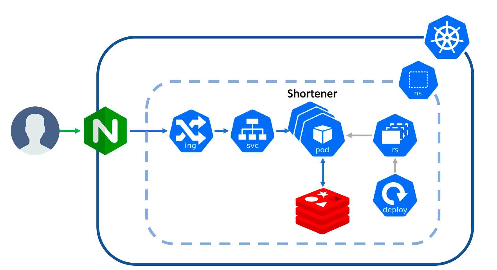
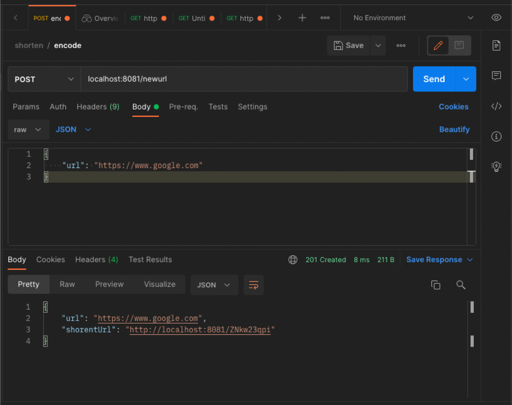
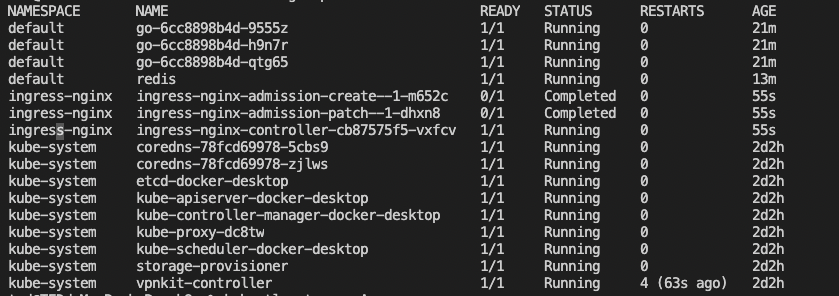
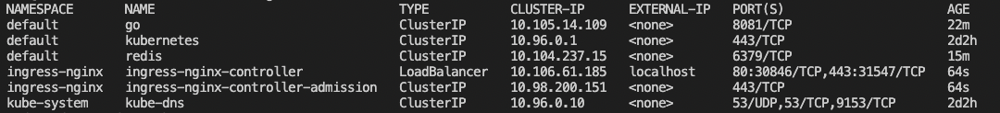

# URL Shortener


## Requirement

- The system should be highly scalable and available.
- Use the short link, the service will redirect to the original link.
- Links will expire after a time span.
- URL redirection  happen in real-time .
- Shortened links should be decoded.

## Database design

### SQL v.s. NoSQL

SQL is good for systems with complex queries, and NoSQL is not.
NoSQL is faster for writes and simply key-value reads.
URL shortener service is a heavy read service, so **NoSQL** is more suitable and scaleable.
Redis is used in this project.

## Encoder - MD5 & base62 & PutIfAbsent

### Base62
Chars: A-Z, a-z, 0-9
Possible urls: 62^9= 1.35e+16

### Encoding Flow
MD5(ex.https://www.google.com) → base62 -> **DSG424S21**Fsj......

It may result in collisions, and PutIfAbsent can resolve it by choosing other chars from encoded strings

## Traffic
1000+ req/s, 95% Read & 5%Write, 2 years

## Cache
Cache is used to speed up database reads by putting data in memory.
By 80-20 role, top 20% most used URLs would be stored in cache

## Load Balancer
[NGINX Ingress Controller](https://kubernetes.github.io/ingress-nginx/deploy/
) could be used as Load Balancer.


## High-Level Architecture
kubernetes is used for High availability and Scalability.
Horizontal and Vertical Pod Autoscaling are good for controlling traffic.



## Deployment

### Shortener
* Programming language: Go 1.17
* Database: Redis
* Kubernetes: 1.22
* Docker Image: [timchencloud/shortener:latest](https://hub.docker.com/layers/timchencloud/shortener/latest/images/sha256:3903d5cbf494bd11d4ba4bd1cc17e86543d28108f4b87be72d41869d573f8570)

Two metholds are provided as below.

### Docker
`docker-compose up`


### Kubernetes
Please install [NGINX Ingress Controller](https://kubernetes.github.io/ingress-nginx/deploy/) first.

```
cd ./Kubernetes
kubectl create -f .
```
Pod
* 

Service
* 

Ingress
* 
